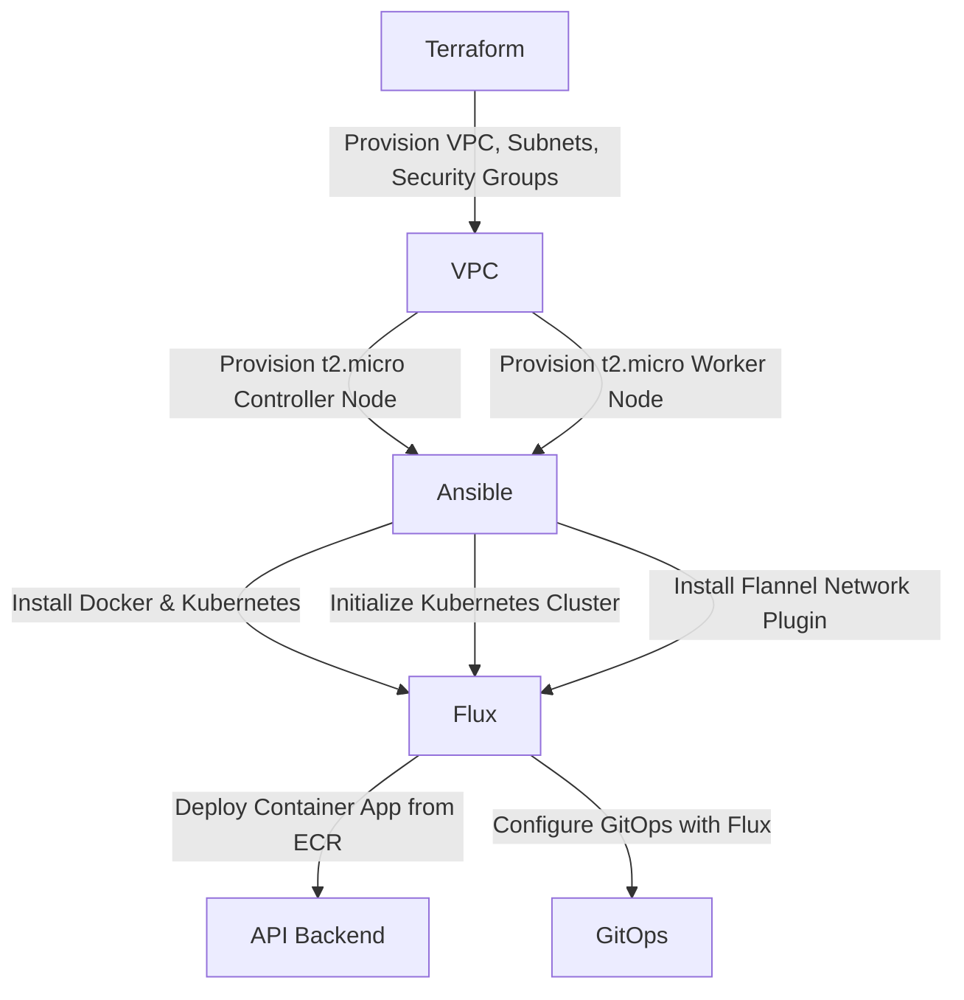

# Kubernetes Cluster Setup with Terraform, Ansible, and Flux

This repository contains code to set up a Kubernetes cluster on AWS using Terraform, configure it with Ansible, and deploy a container app from ECR using Flux. The cluster consists of two `t2.micro` instances: one as the controller and one as the worker node.

## Steps

1. **Terraform Deployment**
   - Deploy two `t2.micro` instances with the necessary security groups and networking:
     - One instance for the Kubernetes controller node.
     - One instance for the Kubernetes worker node.

2. **Ansible Configuration**
   - Install Docker and Kubernetes components on both instances.
   - Initialize the Kubernetes cluster on the controller node.
   - Join the worker node to the Kubernetes cluster.
   - Install the Flannel network plugin across the cluster.

3. **Flux Deployment**
   - Set up Flux to monitor a Git repository and deploy the container app from ECR to the Kubernetes cluster.

## Prerequisites

- AWS CLI configured
- Terraform installed
- Ansible installed
- kubectl installed

## Usage

### Terraform

```sh
terraform init
terraform apply
```

### Ansible

Update the `hosts` file with the IP addresses of your controller and worker instances.

```sh
ansible-playbook -i hosts setup-playbook.yml
```

### Flux

Apply the Flux configuration to manage deployments on the Kubernetes cluster.

```sh
kubectl apply -f flux.yaml
```

## Diagram



## Conclusion

This setup demonstrates how to deploy a Kubernetes cluster on AWS with one controller and one worker node using Terraform, configure it with Ansible, and manage deployments with Flux.


