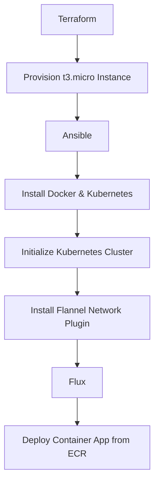

# Kubernetes All-in-One Setup with Terraform, Ansible, and Flux

This repository contains code to set up an all-in-one Kubernetes cluster on a t3.micro instance using Terraform, configure it with Ansible, and deploy a container app from ECR using Flux.

## Steps

1. **Terraform Deployment**
   - Deploy a t3.micro instance with the necessary security groups and networking.

2. **Ansible Configuration**
   - Install Docker and Kubernetes components.
   - Initialize the Kubernetes cluster.
   - Install the Flannel network plugin.

3. **Flux Deployment**
   - Set up Flux to monitor a Git repository and deploy the container app from ECR.

## Prerequisites

- AWS CLI configured
- Terraform installed
- Ansible installed
- kubectl installed

## Usage

### Terraform

```sh
terraform init
terraform apply
```

### Ansible

Update the `hosts` file with the IP address of your instance.

```sh
ansible-playbook -i hosts setup-playbook.yml
```

### Flux

Apply the Flux configuration.

```sh
kubectl apply -f flux.yaml
```

## Diagram



## Conclusion

This setup demonstrates how to deploy a Kubernetes cluster on AWS using Terraform, configure it with Ansible, and manage deployments with Flux.
