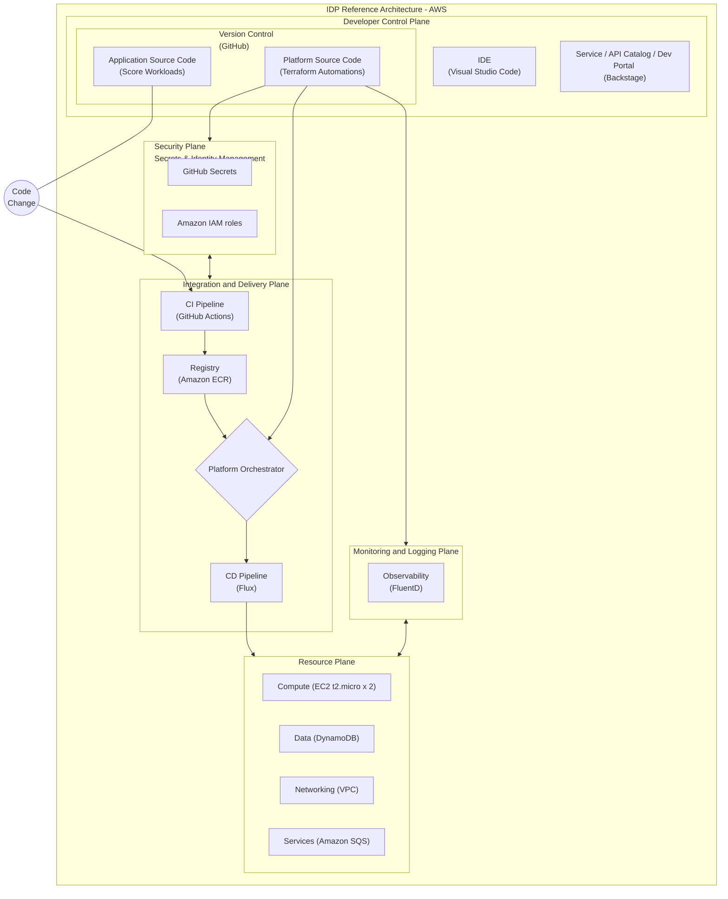

# aws-idp-mini-ra
AWS Internal Developer Platform (IDP) mini Reference Architecture

```mermaid
flowchart TB
 subgraph IDP_mini_RA_AWS["IDP Reference Architecture - AWS"]
        Developer_Control_Plane["Developer Control Plane"]
        Integration_and_Delivery_Plane["Integration and Delivery Plane"]
        Resource_Plane["Resource Plane"]
        Monitoring_and_Logging_Plane["Monitoring and Logging Plane"]
        Security_Plane["Secrets & Identity Management"]
 end
 subgraph Developer_Control_Plane["Developer Control Plane"]
        Version_Control
        IDE["IDE <br>(Visual Studio Code)"]
        Service_Catalog["Service / API Catalog / Dev Portal <br>(Backstage)"]
 end
 subgraph Version_Control["Version Control <br>(GitHub)"]
        App_Source_Code["Application Source Code <br>(Score Workloads)"]
        Platform_Source_Code["Platform Source Code <br>(Terraform Automations)"]
 end
 subgraph Integration_and_Delivery_Plane["Integration and Delivery Plane"]
        CI_Pipeline["CI Pipeline <br>(GitHub Actions)"]
        Registry["Registry <br>(Amazon ECR)"]
        Platform_Orchestrator_Node{"Platform Orchestrator"}
        CD_Pipeline["CD Pipeline <br>(Flux)"]
 end
 subgraph Resource_Plane["Resource Plane"]
        Compute["Compute (EC2 t2.micro x 2)"]
        Data["Data (DynamoDB)"]
        Networking["Networking (VPC)"]
        Services["Services (Amazon SQS)"]
 end
 subgraph Monitoring_and_Logging_Plane["Monitoring and Logging Plane"]
        Observability["Observability <br>(FluentD)"]
 end
 subgraph Security_Plane["Security Plane<br>Secrets & Identity Management"]
        GitHub_Secrets["GitHub Secrets"]
        IAM_Roles["Amazon IAM roles"]
 end

    App_Source_Code --- Commit(("Code <br> Change"))
    Commit --> CI_Pipeline 
  
    CI_Pipeline --> Registry
    Registry --> Platform_Orchestrator_Node
    Platform_Source_Code --> Platform_Orchestrator_Node
    Platform_Orchestrator_Node --> CD_Pipeline

    CD_Pipeline --> Resource_Plane
    Platform_Source_Code --> Monitoring_and_Logging_Plane
    Monitoring_and_Logging_Plane <--> Resource_Plane
    Platform_Source_Code --> Security_Plane
    Security_Plane <--> Integration_and_Delivery_Plane
```
