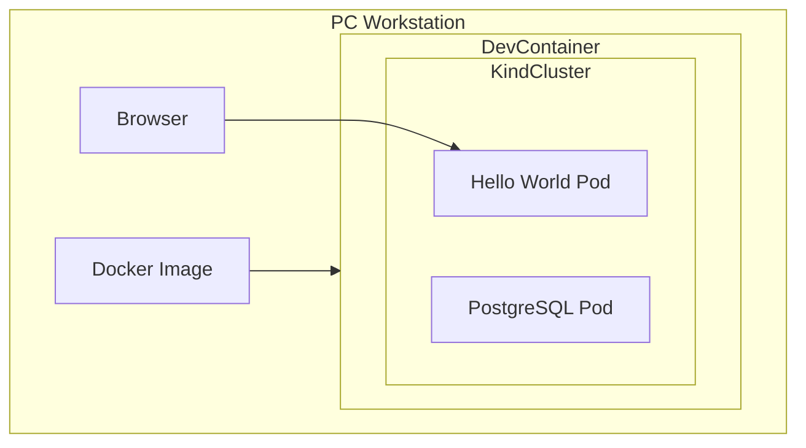
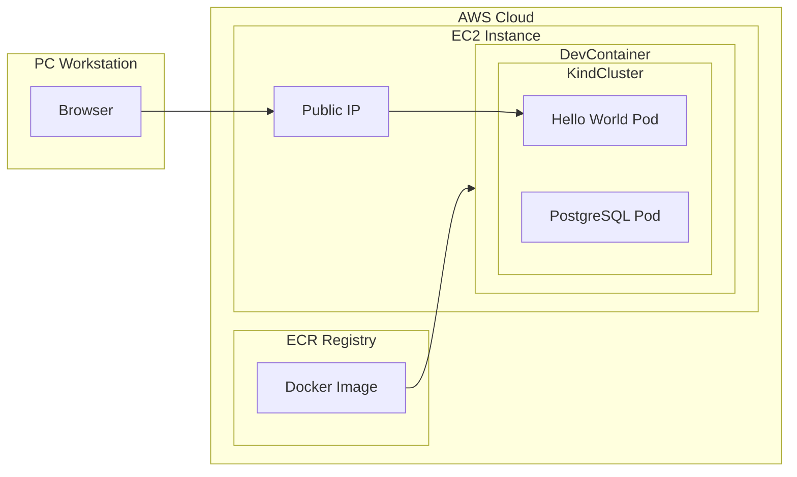
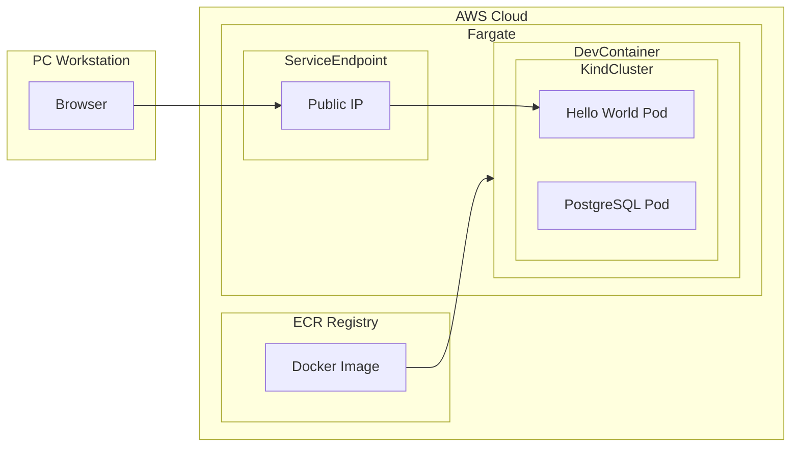
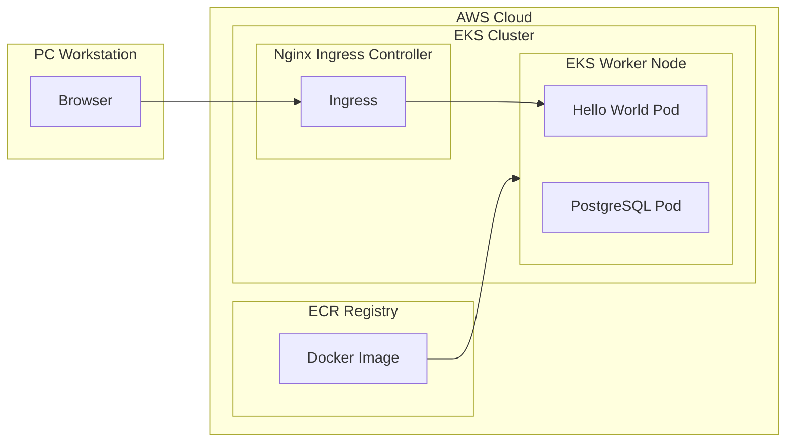
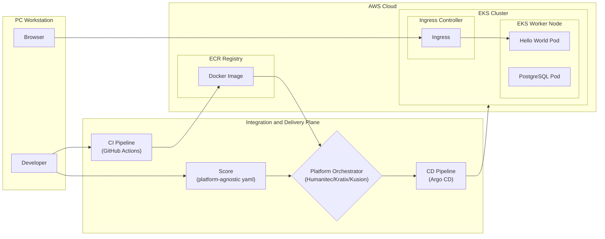

# Infra for Devs made Simple: from Kind to IDP
Kubernetes in Docker (Kind) is the Only Infrastructure Knowledge Developers Need

## Overview

A brief description of your project, outlining its purpose and functionality.

## Prerequisites

- List of prerequisites for development or deployment.

## Setup

1. **Local Development**
   - Instructions for setting up the environment locally.

2. **Deployment**
   - Steps for deploying the application in various environments.

## Architecture Overview

A high-level description of the system architecture.

## Deployment Scenarios

### 1) It works on my PC

This diagram represents:

- **Workstation**: The local development environment.
- **DevContainer**: Contains the development environment within Docker.
- **KindCluster**: A Kubernetes cluster for local testing.
- **HelloWorldPod** & **PostgreSQLPod**: Example application and database pods.
- **Browser**: Local testing of the application.

### 2) It works on my EC2 instance

This setup shows:

- **AWS**: Hosts the EC2 instance where your application runs.
- **ECR**: For storing Docker images.
- **EC2**: Runs your containers with public access via **PublicIP**.

### 3) Standalone container in AWS-managed Fargate services

Here, **Fargate** provides a serverless compute engine for containers:

- **ServiceEndpoint**: Represents how external traffic is directed to Fargate tasks.

### 4) DevOps-automated AWS-managed K8s service EKS

- **EKS**: Managed Kubernetes service where:
  - **Nginx Ingress**: Manages access to Kubernetes services.

### 5) Platform-orchestrated AWS-managed EKS (simplified)

This section outlines more advanced Platform orchestrator for configuration, enhancing the automation and consistency across development environments:

**Explanation:**

- **Score**: Developers define their application's requirements using Score's platform-agnostic YAML configuration. This file describes what resources and services the application needs without specifying how they should be implemented on each platform.

- **CI Pipeline**: **GitHub Actions** or similar CI tools are used to build and test the application, pushing the Docker images to **Amazon ECR**.

- **Platform Orchestrator**: Tools like **Humanitec**, **Kratix**, or **Kusion** interpret the Score configuration. These orchestrators understand how to translate Score's abstract requirements into concrete cloud-native resources across different environments or platforms.

- **CD Pipeline**: **Flux** is utilized for continuous deployment, ensuring that the Kubernetes (EKS) environment reflects the state defined by the Score configuration, automatically deploying or updating services as changes are detected in the Git repository or Docker images.

- **Developer**: The process starts with developers writing code and Score configurations, which then triggers the CI/CD pipeline.

- **Browser**: Represents the end-user accessing the application through the **Ingress Controller** in EKS.

This setup leverages Score to abstract away the complexity of environment-specific configurations, allowing for a more streamlined, consistent, and efficient deployment process across various cloud platforms, with a focus on AWS EKS for Kubernetes management.

### 6) Internal Developer Platform (IDP) mini Reference Architecture

Internal Developer Platform (IDP) architecture aims to provide a seamless experience for developers, where:

- **Developers** only need to interact with a simplified **Developer Control Plane**, reducing their cognitive load and allowing them to focus on coding and feature development.

- **Integration and Delivery** processes are automated, ensuring that code changes are efficiently tested, built, and deployed without manual intervention, leveraging tools like Score for configuration.

- **Resources** are dynamically provisioned

IDP abstracts the complexities of infrastructure, providing developers with self-service capabilities to manage their applications. Here's a breakdown of the key abstractions:

- **Developer Control Plane**: 
  - This is the interface through which developers interact with the platform. It abstracts away the underlying complexity, providing tools, APIs, or a dashboard where developers can define application requirements, manage deployments, and monitor application health without needing deep infrastructure knowledge.

- **Integration and Delivery Plane**:
  - Encompasses the CI/CD pipelines, orchestration tools, and configuration management systems like Score, Flux, or Argo CD. This plane takes the developer's code and configurations, builds, tests, and deploys them onto the resource plane, ensuring continuous integration and delivery.

- **Resource Plane**:
  - Represents the actual infrastructure where applications run, including cloud services (like AWS EKS), virtual machines, storage, and networking. This plane is managed by the platform to provide scalable, secure, and efficient resources as defined by the application requirements.

- **Monitoring and Logging Plane**:
  - Provides tools for collecting, storing, and analyzing logs, metrics, and traces from applications and infrastructure. This abstraction helps developers and operators understand application performance, troubleshoot issues, and ensure compliance with SLAs without managing the underlying monitoring infrastructure.

- **Secrets & Identity Management**:
  - Manages sensitive information like API keys, credentials, and certificates, as well as identities for both humans and services within the platform. This plane ensures secure access control, secrets rotation, and compliance with security policies, abstracting the complexity of security management from the developer.
