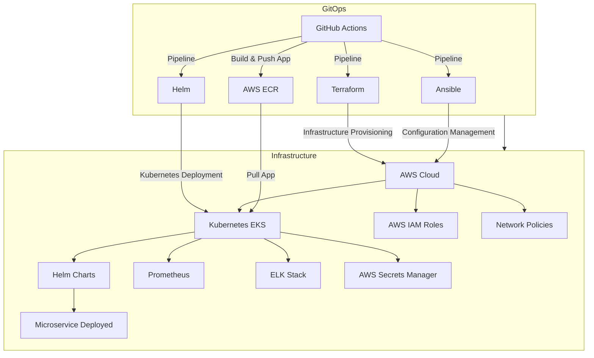

# Platform-MPV GitOps Workflow

This repository contains a diagram representing a comprehensive GitOps workflow. The diagram illustrates the integration of various tools and services used in a typical GitOps pipeline, including CI/CD, infrastructure provisioning, configuration management, and deployment.

## Diagram

## Components

### CI/CD Pipeline
- **GitHub Actions**: Orchestrates the CI/CD pipeline.
- **Terraform**: Used for infrastructure provisioning.
- **Ansible**: Used for configuration management.
- **Helm**: Used for Kubernetes deployment.
- **AWS ECR**: Stores Docker images.

### Infrastructure
- **AWS Cloud**: Cloud provider.
- **Kubernetes (EKS)**: Kubernetes service on AWS.
- **Helm Charts**: Manages Kubernetes applications.
- **Microservice Deployed**: Final deployment stage.
- **Prometheus**: Monitoring.
- **ELK Stack**: Logging.
- **AWS IAM Roles**: Manages access and permissions.
- **AWS Secrets Manager**: Manages secrets.
- **Network Policies**: Manages network traffic.

## License

This is free and unencumbered software released into the public domain.

Anyone is free to copy, modify, publish, use, compile, sell, or distribute this software, either in source code form or as a compiled binary, for any purpose, commercial or non-commercial, and by any means.

For more information, please refer to <http://unlicense.org/>

